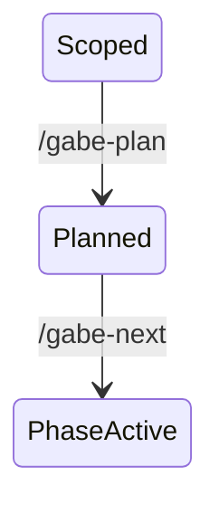
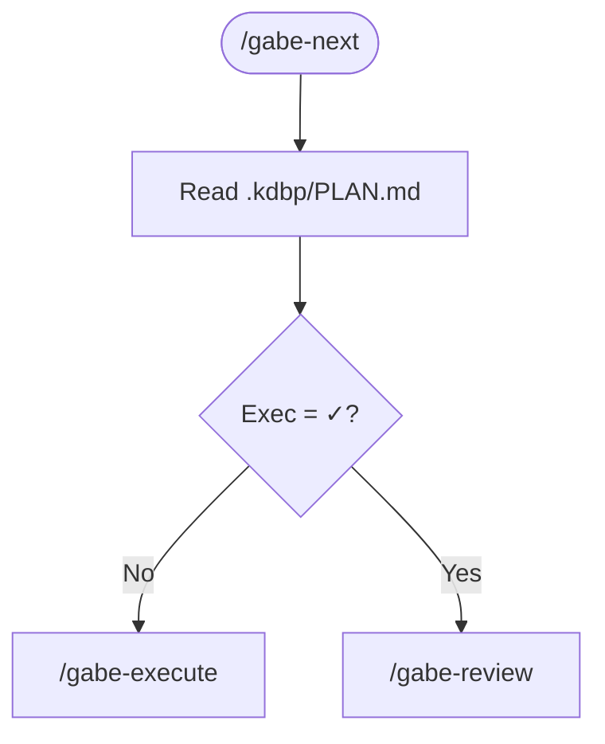
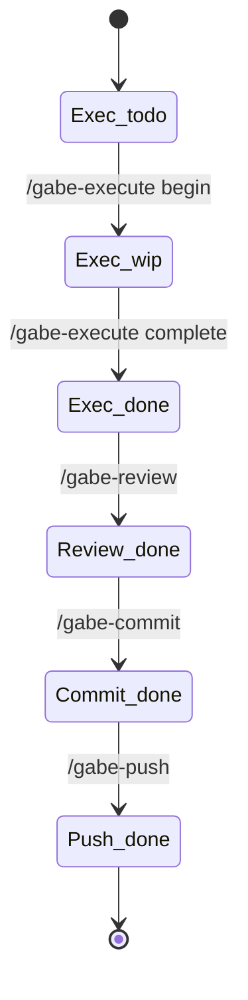

# Diagram Standards — Gabe Suite

**Scope.** Conventions for diagrams that appear in Gabe Suite docs (this repo) and in docs generated by the suite (downstream projects).

**Canonical reference.** [skills/gabe-docs/SKILL.md](../../skills/gabe-docs/SKILL.md) — the runtime standard consulted by `/gabe-commit docs-audit`, `/gabe-init`, and `/gabe-teach`. This file is a **short-form summary + suite-specific conventions** on top of that standard.

If this file and the skill disagree, the skill wins.

---

## What the skill already defines

1. **CommonMark strict.** No Setext headers, no ambiguous indented code blocks, no mixed list markers.
2. **Mermaid is the default diagram format.** Rendered natively by GitHub, Claude.ai, most MD renderers.
3. **Mermaid v10+ syntax only.** Specify diagram type on first line. Keep focused: 5–10 nodes ideal, 15 max.
4. **Label with intent, not just names.** `Classify[Cheap classifier]` not `A`.
5. **Diagram type selection table.** Full table at `skills/gabe-docs/SKILL.md` — summary below:

| Diagram type | Best for |
|--------------|----------|
| `flowchart` | process flows, decision trees, data-flow overviews |
| `sequenceDiagram` | API interactions, message flows |
| `stateDiagram-v2` | state machines, lifecycle stages |
| `erDiagram` | database schemas |
| `classDiagram` | object models |
| `gitGraph` | branch strategies |

---

## Suite-specific conventions (additions to the skill)

These rules apply when diagramming the Gabe Suite itself (workflow, state machine, command dispatch).

### Suite state-machine diagrams

**Type.** Always `stateDiagram-v2`.

**Node naming.** Use domain names (`Scoped`, `PhaseActive`, `PlanComplete`), not abstract IDs. Use PascalCase without punctuation (Mermaid state diagrams choke on em-dashes, slashes, emoji).

**Transitions.** Label with the command or event that drives the transition, exactly as a user would type it:



Do not label with prose. Do not abbreviate command names. If multiple commands can drive a transition, list them on separate edges rather than as "or" text.

**Self-transitions.** Use for same-state evolutions like `Scoped --> Scoped: /gabe-scope-change (addition)`.

### Command dispatch diagrams

**Type.** `flowchart TD` (top-down).

**Node shapes:**

| Shape | Semantic |
|-------|---------|
| `([rounded])` | command entry point (user-invoked) |
| `[rectangle]` | read/write step |
| `{diamond}` | decision point |
| `[/parallelogram/]` | dispatched command (output, another `/gabe-*`) |

**Example:**



### Phase state diagrams

**Four-column model.** Each phase has `Exec | Review | Commit | Push`. When diagramming a single phase's lifecycle, use `stateDiagram-v2` with states named `<Column>_<Value>`:



Avoid Unicode state symbols (⬜ 🔄 ✅) in Mermaid source — Mermaid parser sometimes chokes. Spell the state (`todo`, `wip`, `done`).

### Avoid

- **Nested diagrams.** Mermaid handles them poorly. Split into two separate diagrams with explicit cross-references in prose.
- **Color overrides.** No `style`/`classDef`/`linkStyle` in suite diagrams unless essential. Default styling renders consistently across viewers.
- **More than one diagram per logical concept.** If three diagrams describe the same transition, they'll drift. Pick one.

---

## Referencing diagrams

Each diagram in suite docs should have:

1. A heading or bold caption naming what it shows.
2. The diagram itself (fenced with ` ```mermaid `).
3. One sentence of prose below explaining what to look at.

Do not hide a diagram in the middle of a prose paragraph.

---

## When to use what — suite doc cheat-sheet

| Doc goal | Use |
|----------|-----|
| "Here is the lifecycle of X" | `stateDiagram-v2` |
| "Here is what this command does step by step" | `flowchart TD` |
| "Here is what data flows between commands" | `flowchart LR` |
| "Here is how these data records relate" | `erDiagram` |
| "Here is how a request moves across services/components" | `sequenceDiagram` |
| "Here is the branch/merge structure" | `gitGraph` |

Everything else goes in a table or prose.

---

## Related

- Runtime library of example diagrams: [skills/gabe-docs/diagrams-library.md](../../skills/gabe-docs/diagrams-library.md)
- Live workflow diagrams: [../WORKFLOW.md](../WORKFLOW.md)
- Doc rendering convention (fence handling): [skills/gabe-docs/SKILL.md](../../skills/gabe-docs/SKILL.md) § Runtime output rendering convention
