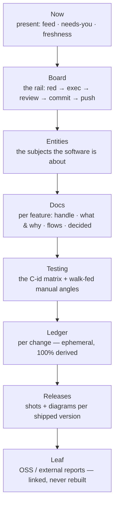

The **Testing Command Center** is the browsable site that shows a project's features, tests, coverage, and releases in one place. The thing to hold onto — the claim the whole [verification-first](verification-first.html) model rests on — is that it is **not a document anyone writes. It is a derived view of the lifecycle's execution.** Ship a feature and the center recounts itself from git, the test corpus, and the plan; nobody hand-updates a page.

## Built separately, never hosted here

One boundary matters before anything else. The command center is a *different site* from this documentation site:

- **This docs site** (`docs/site/`) is prose about the suite — the pages you're reading now. Markdown is its source of truth.
- **The command center** (`docs/site/center/`) is a machine-truth build about *one project's* features and tests. Its source of truth is git, junit, coverage, and the `.kdbp/` state — never hand-authored HTML.

They are never mixed. This page *describes* the command center; it does not host it. The center is generated per project by its own skills, from that project's own machine sources.

## The subject spine

The center is one subject spine — seven stations plus a leaf for external reports — read top to bottom:

Each station answers a different question a person actually asks: *what needs me right now* (Now), *where is everything in the pipeline* (Board), *what is this software about* (Entities), *what does feature X do and why* (Docs), *what has actually been seen to work or fail* (Testing), *what changed in this one change* (Ledger), *what shipped* (Releases).

## The whole chain, mapped

The spine above is the vertical skeleton. The real payoff is seeing how *one* sidebar item connects all the way through to the commands that produce it. The map below traces it end to end — **the nav as a project renders it today → the center's sections → the files execution writes → the suite commands that write them** — colour-coded by beat, with a gap table underneath that prices every mismatch between the nav and the ruled structure.

:::note This is a snapshot — open the live version
**[Open the interactive map →](map.html)** to pin any node and trace its full chain: pin `PLAN.md · PLAN.json` to see the six writers a guard hook verifies (dashed crimson = it blocks a ✓ whose proof doesn't exist, D7), pin `walks.jsonl` to watch one file feed manual angles *and* adopt's approval reads, pin the `A3 generator` for the build's whole footprint. It traces the structure over one project's real data — the shape is what generalizes.
:::

## Two axes: entity × altitude

The spine is read along two axes at once. **Entity** is horizontal — which subject (Transaction, Account, …). **Altitude** is vertical — docs sit high (the human-facing "what & why"), tests sit low (the machine-facing "what was proven"). They are two lenses on the *same* subject at different altitudes, and they meet at the **feature card**: one feature's doc page and its test page are the same subject seen from two heights. Time — past, present, future — is an **overlay** on this grid, never a fourth wing.

## The accumulator / ephemeral split, and the two clocks

Not every page ages the same way, and the split is deliberate:

- **Accumulator pages** *accrue* over a feature's life — the docs page for a feature and its testing page gather handle, flows, decisions, automated angles, walk-fed manual angles, and a verification changelog as the feature matures.
- **Ephemeral pages** are **100% derived and disposable** — a ledger page for one change is rebuilt from git every refresh and owes nothing to memory.

That's the **two clocks** from the verification-first model made concrete: the **present is replaced** on every refresh (so it can't drift), while the **past accrues in git** (so it's never hand-kept). The testing station is the clearest example — its matrix is one row per test:

| Case | Ever red? | Status | Source | Last run |
|---|---|---|---|---|
| `C147` | ✅ born red | pass | unit | this build |
| `C201` | ✅ born red | fail | integration | this build |
| `C088` | — backfilled | pass | unit | this build |

**Ever-red** is the honesty column: a case that was born through [`/gabe-red`](gabe-red.html) carries proof it once failed on purpose; a case backfilled with a [C-id](c-id.html) after the fact gets the id but its ever-red stays honestly empty. Nothing here is typed by a human — every cell is stitched from junit and the `RED:` trailers by C-id.

## Where the facts come from — and what is never stored

Three machine spines feed the center, and one thin seam of authored prose translates them:

- **git** — commits, `RED:`/`Cases:` trailers, and lens briefs.
- **the C-id'd corpus** — every test, its identity, and (via junit) its status.
- **`.kdbp/`** — the authored project state: SCOPE, PLAN, PENDING, walks.jsonl, DECISIONS, and the rest.
- **center inputs** — the *only* prose the center holds: `center.config.json`, the feature cards, and proof manifests. Authored artifacts only *translate*; they never assert a count.

:::note Never stored, always derived
Ledger pages, changelogs, regression relationships, the ever-red column, scope joins, and the non-phase lane are **never** written to disk — they are recomputed on every build. Storing any of them would violate the anti-bloat law and invite drift. (See [the four laws](verification-first.html).)
:::

## Flow coverage — the golden path, proven or loudly not

Each entity card carries a `# FLOWS` section — one line per user-visible flow, `` - <key> [★] → <description> ``, with a single `★` marking the **golden path**. Every proof set's manifest may declare `role:` (`principal | edge | reference | supporting`) and `flows:` (the card keys it walks). The build joins the two into a per-entity verdict that renders on the Evidence tab and rides `archmap.json` as a machine-readable `coverage` block — covered/total, golden covered/total, and the unproven keys by name, so agents read numbers, never scrape HTML.

The honesty rules do the real work:

- **Explicit beats inference.** With no manifest signal the build may *infer* a match from the set's identity text — but the topline says how many covered flows rest on inference alone ("confirm with `flows:`"), and each rides the ledger as an XS confirm-move.
- **A malformed signal is never guessed over.** A typo'd role, a `flows:` that isn't a list, a key the card doesn't have — the set renders **unclassified with its reason** and feeds a clarify move. Guessing over a broken declaration is how a reference set becomes golden coverage.
- **A reference set never covers.** What the screen was built to match is not proof of the workflow.
- **A malformed `FLOWS` line surfaces** — build warning, coverage-note count, ledger move — never a silent drop: a shrunken denominator lies about the card.
- **An unproven `★` is the loudest gap on the shelf** — a placeholder row where the proof will live, plus a Pending move reading "GOLDEN PATH — no proof".

The first real run proved the design: when explicit `flows:` landed on gastify's manifests, transaction's coverage went **down** — 6/9 to 4/9 — because two flows had been "covered" only by token-noise inference (one of them matched the literal text "**no** delete"). The lower number is the true one, and the center now says so itself.

## Getting a center onto a project

Two skills feed the center from opposite ends, and a third reads it:

- **[`/gabe-feature`](commands.html)** is the forward track: each shipped feature is translated into its card, diagrams, and evidence narration over the machine facts, and the center regenerates green.
- **`/gabe-adopt`** is the brownfield on-ramp for a project that already has code but no center. It **archives existing docs — never deletes them** — and bootstraps the center from suite templates, then machine-ranks a critical/high shortlist for the operator, and ingests **one entity per run at human speed**, with each approval recorded as a [walk](commands.html). The adoption tracker lives *outside* `PLAN.md`, so the main plan keeps shipping features through the normal loop while adoption proceeds on its own track — the two meet in the same center. (This is decision [R7](decisions.html).)
- **`/gabe-entity`** is the reader: it assembles one entity's slice — its code map, registry, and bindings — into a context pack from the center's committed data, without re-reading the codebase.

:::note Next
- [The one picture & the four laws](verification-first.html) — the model this page is the flagship instance of.
- [The C-id scheme](c-id.html) — the identity that makes the test matrix stitchable.
- [Design decisions](decisions.html) — D2 (the walk witness feeding manual angles), D3 (release-page media), and R7 (`/gabe-adopt`).
:::
