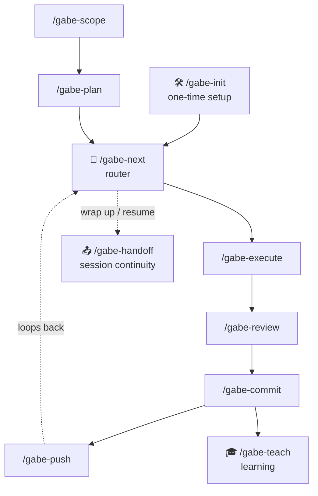

## How they fit together

The **core loop** (scope → plan → red → next → execute → review → commit → push) is the spine a project rides from first idea to shipped commit — `/gabe-red` puts the failing test cases on the record before code, and `/gabe-next` is a pure router that reads `.kdbp/PLAN.md` and tells you which of the others to run next, so in practice you rarely choose manually. **Setup** is `/gabe-init`, run once per project to lay down `.kdbp/` and the hooks — plus `/gabe-adopt` for brownfield projects adopting the Testing Command Center. **Session continuity** is `/gabe-handoff`, run when a session ends or context fills up — it writes the next-session resume prompt and syncs `.kdbp/` so the work picks up mid-phase without loss. Every command sits under the same E1–E7 execution contract (see [The E1–E7 contract](contract.html)) — the gates below are each command's specific tightening of that shared floor.

:::note Refresh in progress
Parts of this page's long-form write-ups predate the 2026-07 suite reshape: `/gabe-teach` is archived (`skills/_archive/`), `ROADMAP.md` folded into SCOPE's `## Phases`, and `/gabe-scope-addition` was absorbed into `/gabe-scope-change`. The **tables** on this page are current; the prose deep-dives are being refreshed.
:::

The deep-dives below cover these workflow commands. The suite's other half — the on-demand **analysis satellites** (roast, health, debt, assess, align, myopic) — has its own page, [Analysis satellites](satellites.html), because those tools run *outside* the loop rather than as steps in it. A complete index of **all 28 skills** (workflow, verification, command center, satellites, scope authoring, and utilities) closes this page.

:::note How to read "key gate"
These are not the only things each command does — they're the specific mechanism the hardening added or hardened, the one that turns a claim ("tests pass," "reviewed," "reused") into something that has to be demonstrated on screen before the command can proceed.
:::

:::note New here?
Start with `/gabe-init`, then let `/gabe-next` drive the loop — it reads `.kdbp/PLAN.md` and tells you which command to run. Read [The E1–E7 contract](contract.html) for the shared floor every command below tightens.
:::

## The core loop — scope → plan → next → execute → review → commit → push

This is the path every unit of work travels. Each step reads state the previous step wrote and writes state the next step will read — the chain is what makes `.kdbp/` a reliable memory instead of a pile of notes.

| Command | Purpose | Key gate it enforces |
| --- | --- | --- |
| `/gabe-scope` | Authors `SCOPE.md` (the stable premise) and `ROADMAP.md` (the phase plan) for a new project or a scope change, one checkpoint-gated step at a time. |  Strict checkpoint gating — every major step needs explicit user approval before the next runs, and final assembly reads the *current on-disk* files first: anything the human edited outside a `[PENDING APPROVAL]` marker is treated as final and diffed before any overwrite, so a session can never silently clobber a human edit. |
| `/gabe-plan` | Creates or updates the phase plan in `.kdbp/PLAN.md` — the row-per-task table every other command reads. |  Per-phase template discipline: Types column plus Scope / References / Acceptance / Checkpoint fields, so `/gabe-execute`'s reads always find the same field names. Auto-tick cross-checks the phase footer and uses enumerated skip codes instead of silently ticking the wrong row. |
| `/gabe-next` | Zero-logic router — reads `.kdbp/PLAN.md` state and dispatches to whichever command comes next. No judgment, no side effects beyond the command it routes to. |  Prior-row sweep: always prints any owed Review/Push debt from earlier phases before advancing — so incomplete prior work stays visible at every routing decision instead of getting buried under the current phase. |
| `/gabe-execute` | Implements the current phase's tasks from `.kdbp/PLAN.md`, checkpointing at commits. |  TASK CONTRACT + REUSE LEDGER gate — quote the task text verbatim, classify it, and print a reuse verdict *before* any Write or Edit. Pairs with a persistent per-task checklist in `PLAN.md` (state survives a session dying) and a T[i] VERIFY evidence block, so "verification ✅" is unprintable without an executed command in front of it. |
| `/gabe-review` | Risk-priced code review with interactive triage, confidence scoring, and plan-alignment checking. |  Mandatory verify/kill pass (Step 4.4) with a per-finding Evidence line — an absence claim ("no tests for X") needs search proof, not confidence talk. Closes both triage bypasses (a skipped CRITICAL, a mid-triage exit) so either path auto-defers instead of vanishing. |
| `/gabe-commit` | The commit quality gate — CHECK 1–9, deferred scan, doc drift — that stands between a diff and `git commit`. Never use raw `git commit`. |  Executed-evidence CHECK gates: every check resolves a real command, shows the evidence row and a 3-state glyph (✅ / ❌ / ⤫ skipped-with-reason), and a hardcoded "tests pass" claim with no command run behind it is exactly the failure this closes. A skip-to-pending path keeps the commit BLOCKED unless force-commit is explicit and logged. |
| `/gabe-push` | Push, PR, CI watch, and environment promotion — env-aware via `.kdbp/PUSH.md`. |  Pasted CI output required (a pending ⏳ run is never treated as a ✅ pass) plus a Step 6.7 deploy-verify smoke probe against the live target — CI can go green while the deployed app is dead, and this step is the check that would have caught it. |

## Setup — run once per project

| Command | Purpose | Key gate it enforces |
| --- | --- | --- |
| `/gabe-init` | Initializes a project with the KDBP stack — creates `.kdbp/`, installs hooks, configures by project type. |  Missing-anchor STOP for hook JSON: hook objects are read verbatim from `~/.claude/templates/gabe/hooks.json`; if that template is absent, init stops hook installation and reports it rather than composing hook JSON from memory — the worst-case failure mode being a hallucinated, destructive write to a project's `settings.json`. |

## Learning — run after commits

| Command | Purpose | Key gate it enforces |
| --- | --- | --- |
| `/gabe-teach` | Consolidates the human's architect-level understanding of recent changes — organizes topics under **gravity wells** (the project's recurring architectural sections, e.g. auth, data layer), explains with analogies, verifies with **Socratic questions** (questions that check understanding by making the human explain it back, not just recognize it), tracks status in `.kdbp/KNOWLEDGE.md`. |  Answer-key grading gate: each Q1/Q2 pair is generated alongside a hidden expected-answer key; the human's answer is scored against that key, not against plausibility, and an uncertain call always rounds the score *down* (never up) — because an inflated "verified" row poisons `KNOWLEDGE.md` for every future session that trusts it. |

:::note Where this comes from
Each gate above is one of the 47 revisions ratified in the 2026-07 hardening pass (42 KEEP, 5 REVISE, 0 KILL) — see [Per-skill hardening reference](reference.html) for the full change log and [Why weak models drift](drift.html) for the incidents that motivated each one.
:::

## Session continuity — run when wrapping up

Added after the 2026-07 hardening pass, `/gabe-handoff` is the deliberate counterpart to the automatic session summary. When a session is ending — or context is filling up toward a compaction — it captures what the mechanical transcript scrape can't: intent, the decisions made, and the exact next move.

| Command | Purpose | Key gate it enforces |
| --- | --- | --- |
| `/gabe-handoff` | Ends a session cleanly: emits a paste-able next-session **resume prompt** (inline plus a singleton `.kdbp/HANDOFF.md`) and syncs durable `.kdbp/` state — a `HANDOFF` entry in `LEDGER.md`, in-flight items into `PENDING.md`, and the `PLAN.md` phase cells — so a fresh session, or a different model, resumes mid-phase without a hand-off conversation. |  Sync-to-observed-reality with per-cell evidence gates — it only ticks a `PLAN.md` cell backed by a cited command, commit sha, or `git` fact, never fabricates a ✅, and never runs the commit/push gates (it records reality, it doesn't create it). The counterweight to the lossy automatic summary that would otherwise tell the next session to redo finished work. |

:::note Why it's separate from the loop
The loop's four-column tick is already a checkpoint (see [The development loop](the-loop.html) § the cadence rule). `/gabe-handoff` is for the messier reality — a session ending mid-task, with intent and half-finished work the tick alone doesn't capture. It writes the resume prompt so the *next* session starts from an accurate plan, not a lossy summary.
:::

## Every command at a glance

The full surface — all 28 skills, grouped. The **core loop**, **setup**, and **session-continuity** commands are detailed above; the **analysis satellites** have their own [page](satellites.html); the remaining rows are documented by this index line (their full specs live in each skill's `SKILL.md` + `references/`).

| Command | Group | What it does | Full write-up |
| --- | --- | --- | --- |
| `/gabe-scope` | Core loop | Authors `SCOPE.md` — the stable premise plus the `## Phases` arc | above |
| `/gabe-plan` | Core loop | Breaks a goal into phases, each with a tier decision + declared proof type, into `PLAN.md` | above |
| `/gabe-red` | Core loop | TDD's first half — declare the failing cases (C-ids born in test names), commit the red checkpoint | this index |
| `/gabe-next` | Core loop | Zero-logic router over the `PLAN.md` status cells | above |
| `/gabe-execute` | Core loop | Implements the phase's tasks under the task + reuse contract | above |
| `/gabe-review` | Core loop | Risk-priced review with interactive triage + growth triage | above |
| `/gabe-commit` | Core loop | The commit quality gate — CHECK 1–9 + results digest | above |
| `/gabe-push` | Core loop | Push, PR, CI watch, deploy-verify | above |
| `/gabe-init` | Setup | Lays down `.kdbp/` + the 6 hooks, by project type | above |
| `/gabe-adopt` | Setup | Brownfield command-center adoption — archive, bootstrap, rank, ingest one section per run | this index |
| `/gabe-handoff` | Session continuity | Resume prompt + evidence-gated `.kdbp/` sync | above |
| `/gabe-walk` | Verification | Records a human walking the build — who·when·result·evidence to `walks.jsonl` | this index |
| `/gabe-feature` | Command center | Covers a shipped feature — card, diagrams, evidence narration; status/backfill/curate/release | this index |
| `/gabe-roast` | Analysis satellite | Adversarial gap review from a chosen perspective | [satellites](satellites.html) |
| `/gabe-myopic` | Analysis satellite | Short-sighted-user walkthrough — foresight traps, overwhelm, recall, no-undo | [satellites](satellites.html) |
| `/gabe-health` | Analysis satellite | Structural health — god files, churn, coupling, bugs | [satellites](satellites.html) |
| `/gabe-debt` | Analysis satellite | Architecture decision-debt scan with AP citations | [satellites](satellites.html) |
| `/gabe-assess` | Analysis satellite | Change impact — blast radius, maturity scope, prerequisites | [satellites](satellites.html) |
| `/gabe-align` | Analysis satellite | Values guardian — pre-flight checks + auto-checkpoint | [satellites](satellites.html) |
| `/gabe-scope-change` | Scope evolution | One entry point — classifies; additions execute inline, pivots route to `-pivot` | this index |
| `/gabe-scope-pivot` | Scope evolution | Direction change — archives `SCOPE.md` v{N}, opens v{N+1} | this index |
| `/gabe-help` | Utility | Context-aware guide — scans state, suggests the next command | this index |
| `/gabe-lens` | Utility | Cognitive translation — analogies, maps, constraint boxes | this index |
| `/gabe-mockup` | Utility | Mockup / UX workflow — static, React Storybook, and design-ref modes | this index |
| `/gabe-docsite` | Utility | Publishes and updates pages on this docs site — placement, nav, rendered diagrams | this index |
| `/gabe-meme` | Utility | Oblique memes — visual metaphors rendered via memegen.link, verified PNGs | this index |
| `/gabe-quip` | Utility | Witty titles/hooks/callouts for human-facing HTML surfaces — dosed, punch-up | this index |
| `gabe-docs` | Background | Documentation standards + the E1–E7 execution contract — consulted by other skills, not invoked | this index |
