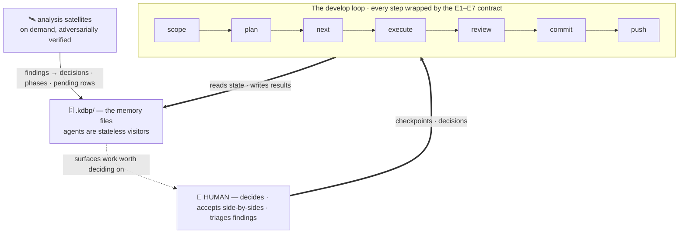

**The Gabe Suite** is a file-based development discipline for building software with AI coding agents. Its one idea: **judgment should live in files, not in the model**. The plan, the decisions, the deferred debt, and the proof of every step are written down in the project's `.kdbp/` — Khujta Deep Behavioural Protocol — folder, so any agent — strong or weak, this session or the next — picks up exactly where the last one left off. This site documents the suite and the 2026-07 hardening that made its discipline mechanical rather than model-dependent.

## The system at a glance

The human sits *outside* the loop — driving it and deciding on what it surfaces, not typing. A shared execution contract (E1–E7) wraps every command so nothing claims "done" without evidence. The commands grind ideas into evidence-backed commits; the memory files are what the agents read and write; the analysis satellites — investigations run on demand, separate from the loop's step-by-step grind — bring back findings worth deciding on.

Four parts: the human decides, the loop grinds, the files remember, the satellites investigate.

:::note The E1–E7 contract in one line
E1–E7 are the seven checks the suite pastes atop every command (full text on the [execution contract](contract.html)): **E1** cite evidence · **E2** run before you tick ✅ · **E3** no silent downgrade of the task · **E4** reuse before you build · **E5** sync state the same turn · **E6** stop on a missing anchor · **E7** report where. When a page tags something "E3" or "E6", it means that rule.
:::

:::note The three load-bearing ideas
 **(1) The model is the replaceable part** — state lives in files, so a session can die or a model can be swapped mid-project and the next visitor resumes from disk.

 **(2) Every arrow carries evidence, not claims** — the contract makes "done" unprintable without a command output, a `file:line`, or an artifact path.

 **(3) The human is the decision layer** — `DECISIONS.md` is the interface; the loop makes those decisions irreversible-in-the-good-way.
:::

:::note New here?
Start with *The development loop*, then *What KDBP is*. Everything else is a card away.
:::
