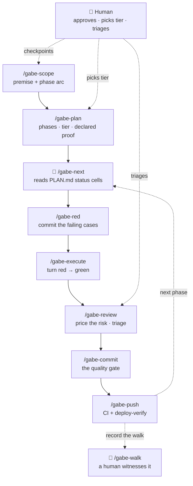

A unit of work travels a fixed path from "we should build X" to a shipped, verified commit: `/gabe-scope` → `/gabe-plan` → `/gabe-red` → `/gabe-execute` → `/gabe-review` → `/gabe-commit` → `/gabe-push`. Each step reads a bit of `.kdbp/` state (the project's on-disk memory — see [What KDBP is](kdbp.html)), does one job, and writes the next step's inputs back to disk. Nobody has to remember what happened three sessions ago — the files remember for you. This page teaches the *shape* of that cycle; for what each beat reads and writes in detail, see [Beats & commands](commands.html).

## The idea in one paragraph

Think of the loop as a relay race where the baton is a folder, not a runner's memory. `/gabe-scope` writes down the premise once. `/gabe-plan` turns a slice of it into phases, each with a size decision and a declared *proof*. `/gabe-red` puts the failing test cases on the record **before** any code exists, so "done" has something to become true against. `/gabe-execute` writes the code that turns those cases green, one task at a time. `/gabe-review` prices the risk in what changed. `/gabe-commit` is the one gate everything must pass through. `/gabe-push` gets it into the world and proves it's actually live. If a session ends mid-phase, the state table remembers exactly where it stopped — the next session (or the next model) picks the baton up without a hand-off conversation.

:::note Why red gets its own beat
A single command can only honestly end in *one* state — but test-first needs two of the same measurement: first the tests **fail**, then they **pass**. Fold both into one "execute" step and the failure is swallowed by the act that produced the green, leaving only self-graded evidence. So the failing state gets a beat of its own, whose whole deliverable is a committed red. That's the load-bearing idea behind [/gabe-red](gabe-red.html).
:::

## The cycle, at a glance

Every arrow below is one command call. `/gabe-next` is the router in the middle — it reads the current phase's status cells and dispatches to whichever beat comes next, so in practice you rarely choose manually. The human sits *above* the loop, approving scope, picking a tier, and triaging findings, rather than typing every step.

:::note Status glyphs
⬜ not started · 🔄 in progress · ✅ done. A phase moves through the cells **Red · Exec · Review · Commit · Push** (Red and a Center cell are optional columns a plan can carry). `/gabe-next` reads those cells and routes — the full routing table lives on [Beats & commands](commands.html).
:::

## What sits off the beat line

Two kinds of work orbit the loop rather than living inside it:

- **The witness — [`/gabe-walk`](commands.html).** Every automated signal in the loop is still produced by an agent. `/gabe-walk` records the one thing no machine can: a *human* actually used the feature, on a date, with a result. It records; it never judges. A station nobody has walked stays red until someone signs it.
- **The advisors — [analysis satellites](satellites.html).** `roast`, `myopic`, `health`, `debt`, `assess`, and `align` are adversarial tools you pull in on demand — before a risky change, during a retro, when something feels fragile. Nothing forces you to run them at a fixed step; they attack from an angle the loop doesn't naturally take and land their findings back where the loop will read them.

## The cadence rule: one phase per session

:::note Close it or checkpoint it
A session should finish one phase, or leave it in a state the next session can resume cleanly — don't stop mid-task with uncommitted work and no note. Every phase transition is a natural place to end: the status-cell tick is already the checkpoint, so honoring it costs nothing extra. When you *do* have to stop mid-task, [`/gabe-handoff`](commands.html) writes the resume state for you — a paste-able next-session prompt plus a synced `.kdbp/` — so the interruption still lands on a clean boundary.
:::

This rule exists because sessions *will* get interrupted — context runs out, priorities shift. The loop is built so that's fine, as long as the interruption happens at a clean boundary: a ticked task, a committed change, a phase pointer that still points somewhere real. What breaks the loop is stopping *without* writing that state down. The next session (possibly a different model entirely) trusts the files, not the transcript.

## Where the human checkpoints sit

The loop automates the mechanical parts — routing, ticking, checking — and deliberately leaves the judgment calls to you. Three points always stop and wait:

- **Plan · tier pick — MVP, Enterprise, or Scale.** `/gabe-plan` shows the trade-off for each phase and waits. Escalating past MVP needs a one-sentence reason logged to `DECISIONS.md`; de-escalating needs none.
- **Review · triage — fix, defer, or accept each finding.** `/gabe-review` never silently fixes or ignores; deferred findings land visibly in `PENDING.md`.
- **Commit · gate — nothing critical slips through.** `/gabe-commit` blocks on unresolved CRITICAL findings. You can force a commit through with a written justification, but never by accident.

## Where to go next

This page showed the shape. The next layer down is the contract every beat shares, and the beat-by-beat detail.

- **[The E1–E7 execution contract](contract.html)** — the seven floors under every command: evidence, run-before-✅, no silent downgrade, reuse-first, state-sync, missing-anchor-stop, report-where.
- **[Beats & commands](commands.html)** — every beat in full: what it reads, what it writes, the gate it enforces, and the zero-logic router table.
- **[What KDBP is](kdbp.html)** — the core idea behind every file this page named.
