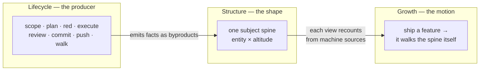

Everything in this suite is downstream of one bet: **a project's confidence should be assembled from machine facts, not asserted by whoever is talking.** A test either failed on the old code and passes on the new — or it didn't. A commit exists at a SHA — or it doesn't. A human walked the feature on a date — or nobody has. *Verification-first* is the name for organizing the whole development loop around producing those facts as it goes, so that "is this done?" is answered by reading disk, never by trusting a claim.

## Why the suite is shaped this way

Picture a strong, careful engineer working next to a junior one. The strong engineer double-checks the file path, runs the command before saying it passed, and asks before quietly shipping a cheaper version of the ticket — not because the ticket said to, but because years of habit made those moves automatic. The junior hasn't built those habits yet, and will write "done ✅" after skimming code instead of running it, in total sincerity.

Gabe's skills are run by models of varying strength — sometimes the careful one, sometimes a fast, literal one. The entire suite is the answer to a single observation: **the disciplined behavior lived in the strong model's judgment, not in the instructions.** So the design goal is always to move judgment *out* of the model and *into* files, gates, and derived views — where a weak model inherits the strong model's floor for free, and a strong model can't quietly skip a step either. The [E1–E7 contract](contract.html) is the smallest version of that move; the [mechanism catalog](mechanisms.html) is the full library; this page is the shape they add up to.

## The one picture

Start with the thing that looks like the product but isn't. The [Testing Command Center](command-center.html) — the browsable site that shows a project's features, tests, coverage, and releases — is **not a thing anyone builds or maintains. It is a derived view of the software lifecycle's execution.** Nobody writes its pages; the lifecycle writes them as a byproduct of doing the work. Read that one object along three cuts:

- **Lifecycle = the producer.** The suite's real job is *developing software*. Every command earns its place by its value to the developer building the thing — never by the docs it emits. The doc points fall out of the beats as byproducts, which is why deleting a command for "authoring no doc" is a category error (see the third law below).
- **Structure = the shape.** One subject spine — Now · Board · Entities · Docs · Testing · Ledger · Releases — read along two axes: **entity** (which subject, horizontal) and **altitude** (docs high, tests low, vertical). Docs and tests are two lenses at the same altitude, meeting at the feature card. Time is an *overlay*, never a fourth wing.
- **Growth = the motion.** Ship a feature and it walks the spine by itself: the ticket closes, the commit lands, and every view recounts from the same machine sources. Two clocks run at once — the **present is replaced** on each refresh, so it can't drift; the **past accrues in git**, so it's never hand-kept.

## The four laws

These are not style preferences. Each one has been violated in a real session and reverted, which is why they read as hard rules rather than suggestions.

| Law | What it forbids | Why |
|---|---|---|
| **1 · Anti-curation** | A count, verdict, or pass/fail that a human typed in. | Machine sources *assert* every number (git, junit, coverage, PLAN, PENDING); authored artifacts only *translate* them. A gap is **named**, never faked green. |
| **2 · Anti-bloat** | Storing anything you can derive; any view that needs refresh-discipline. | If it can be recomputed from git and the corpus, it is recomputed — never saved. Deriving *narrative* from git is the exception: that's fabrication, not projection, and is forbidden too. |
| **3 · The Standing Correction** | Judging a command by whether it emits a doc artifact. | A prior pass deleted `/gabe-execute` for "authoring no doc" — the canonical error. A command is justified by its value to the *build*, full stop. |
| **4 · Block lies, warn debts** | A harness that blocks honest incompleteness, or lets a dishonest state through. | Hooks **block** a dishonest state — a ✅ whose proof doesn't exist on disk. Everything else — thin coverage, un-walked stations, absent angles — is **reported, never blocked.** This is decision [D7](decisions.html); the walk witness is [D2](decisions.html). |

:::note The tripwire built into the model
The suite is allowed to add verification, never ceremony. The standing test: if a verification beat ever prints a *summary a developer reads* instead of producing a *failure a developer must fix*, it has become theatre — delete it. `/gabe-red` carries this tripwire explicitly.
:::

## Where this lands in the loop

The abstract model becomes concrete at three specific beats, each of which has its own page:

- **[/gabe-red](gabe-red.html)** puts the failing test on the record *before* any source is written — the beat that finally made test-first land, and the one that produces "ever-red" honesty.
- **[The C-id scheme](c-id.html)** gives every test a durable identity so a claim of coverage can be checked, recovered, and counted mechanically.
- **[The command center](command-center.html)** is the derived view itself — the eight sections, the two clocks, and how a shipped feature walks the spine (with an [interactive map](map.html) of the whole nav → files → commands chain).

:::note Where to go next
If you're here to understand *why the gates exist at all*, read [Why weak models drift](drift.html) (the incident corpus) and [the mechanism catalog](mechanisms.html) (the fixes). If you're here to understand *how the loop runs day to day*, read [The development loop](the-loop.html) and [Beats & commands](commands.html). The rulings that fixed this architecture — including block-lies-warn-debts — are on [Design decisions](decisions.html).
:::
