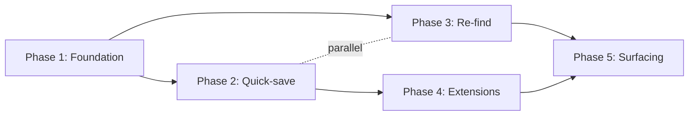

# SCOPE — bookmark-manager

> **This is the stable backbone.** Changes to this document — premise and phase arc alike — flow exclusively through `/gabe-scope-change`.

## 0. Reference Frame {#reference-frame}

| ID | Weight | Path | Role |
|---|---|---|---|
| ref-01 | authoritative | ~/.claude/rules/common/coding-style.md | Coding style we follow |
| ref-02 | suggestive | ./docs/wireframes/ | UX direction from prior sprint |

## 1. One-liner {#one-liner}

A local-first bookmark manager that surfaces what you actually need when you need it, without you having to remember you saved it.

## 2. Problem {#problem}

Knowledge workers accumulate hundreds of bookmarks across browsers, read-later apps, and note-taking tools. The bookmark is saved; the intent behind saving it is lost. When the need returns, you either can't find it ("was it Pocket or Raindrop?") or don't remember you saved it at all.

Evidence: personal experience across 3 browsers × 5 years × ~1,200 bookmarks. Informal surveys in two Discord servers show ~40% of members routinely re-find content they've already saved.

## 3. Vision / North Star {#vision}

In 1–3 years: an ambient tool that watches what you're working on and surfaces the bookmark you saved eight months ago that's suddenly relevant again — before you ask.

## 4. Primary User & Jobs-to-be-Done {#primary-user}

**Primary user:** Solo knowledge workers (developers, researchers, writers) who save 100+ links per year and routinely re-search for content they've already bookmarked.

**Jobs-to-be-Done:**
- **When I** save a link while reading, **I want to** add context (why I care) in one keystroke, **so I can** understand my past intent later.
- **When I** return to a topic after weeks, **I want to** see all my saved material about it without remembering I saved it, **so I can** build on prior research instead of starting over.

## 5. Secondary Users {#secondary-users}

- **Small teams (≤5 people)** — could share a common knowledge pool. Ranked below primary because the single-user experience must dominate design decisions.

## 6. Non-Users {#non-users}

- **Enterprise teams (>50 people)** — shared taxonomy management, access controls, and audit trails are explicitly out of scope.
- **Casual bookmarkers (<50 links/year)** — the tool's value hinges on re-find friction, which casual users don't feel.
- **Users who want a social / discovery feed** — this is not a Twitter-alternative or a Pinboard clone.

## 7. Success Criteria {#success-criteria}

- **SC-01** {#sc-01} — A user can save a link with context in ≤3 seconds from clipboard.
- **SC-02** {#sc-02} — A user can re-find a bookmark by approximate topic in ≤30 seconds without remembering the exact title or URL.
- **SC-03** {#sc-03} — A user can see surfaced-to-them bookmarks when opening the app, without querying.

## 8. Non-Goals {#non-goals}

### NG-01 — Multi-user sync {#ng-01}
**Statement:** We will not build sync beyond a single person's devices.
**Why:** Collaboration features would dominate scope and dilute the ambient-surfacing focus.

### NG-02 — Mobile-first {#ng-02}
**Statement:** We will not build a mobile-first experience in v1.
**Why:** Re-find friction is dominant on desktop; mobile-first would force UX compromises that hurt the core use case.

### NG-03 — Hosted SaaS {#ng-03}
**Statement:** We will not offer a paid SaaS with hosted sync.
**Why:** Local-first is an architecture commitment, not a feature toggle.

## 9. Constraints {#constraints}

| Dimension | Constraint |
|---|---|
| Tech stack | Tauri + React + SQLite (local) per ref-01 |
| Budget | $0 infra (local-first); token budget ≤ $20/mo for AI surfacing |
| Timeline | v1 shipped to self by end of Q2 |
| Regulatory | GDPR-trivial (no PII leaves device) |
| Team size | 1 (solo project) |
| Infra | Desktop binaries for macOS + Linux |

## 10. Architecture Posture {#architecture-posture}

- **Synchrony:** async-first for AI surfacing, sync for CRUD
- **Topology:** single-binary desktop app
- **Data gravity:** local-first (SQLite); no cloud
- **Deployment target:** user's laptop
- **Integration surface:** browser extensions (Chrome, Firefox) + optional clipboard watcher

## 12. Requirements {#requirements}

### REQ-01 — Clipboard quick-save {#req-01}
**Covers SCs:** [SC-01](#sc-01)
**Description:** Global hotkey captures URL from clipboard + prompts for one-line context. Saved in ≤3s.
**Acceptance signal:** Benchmark: 10 saves averaged; p95 ≤ 3s from hotkey to stored record.

### REQ-02 — Semantic re-find {#req-02}
**Covers SCs:** [SC-02](#sc-02)
**Description:** Search by approximate topic (embedding-based). No exact-string requirement.
**Acceptance signal:** User test: find a bookmark saved 60+ days ago using only topic recall; ≤30s.

### REQ-03 — Ambient surfacing {#req-03}
**Covers SCs:** [SC-03](#sc-03)
**Description:** On app open, surface 3–5 bookmarks the user is likely to find useful right now, based on recent browser history + calendar context.
**Acceptance signal:** User reports ≥1 surprise-useful surfacing per week for 4 weeks.

### Coverage matrix (auto-generated)

| Success Criterion | Covered by REQs |
|---|---|
| SC-01 | REQ-01 |
| SC-02 | REQ-02 |
| SC-03 | REQ-03 |

## Phases {#phases}

### Granularity

- **Chosen:** standard (5 phases, sprint-sized)
- **Alternatives considered:** coarse (3 phases), fine (8 phases)

### Phase Table (at a glance)

| ID | Name | Status | Depends-on | Parallel-with | Covers REQs |
|---|---|---|---|---|---|
| 1 | Foundation + storage | pending | — | — | — |
| 2 | Clipboard quick-save | pending | 1 | — | [REQ-01](#req-01) |
| 3 | Semantic re-find | pending | 1 | 2 | [REQ-02](#req-02) |
| 4 | Browser extensions | pending | 2 | — | — |
| 5 | Ambient surfacing | pending | 3, 4 | — | [REQ-03](#req-03) |

#### Status vocabulary
- **pending** — not started
- **in-progress** — at least one task checked off in per-phase PLAN.md
- **blocked** — dependency or external blocker
- **complete** — all Covers REQs satisfied; validated by `/gabe-align`
- **deferred** — moved out of the current arc (retained for audit)

#### ID conventions
- **Integer IDs** (1, 2, 3, …) are root phases from the initial `/gabe-scope` authoring.
- **Decimal IDs** (1.1, 2.3, …) are `/gabe-scope-change` Addition-path insertions between root phases.

### Phase Detail

#### Phase 1 — Foundation + storage {#phase-1}

**Status:** pending
**Goal:** By end of this phase, the Tauri app boots with an empty SQLite database, ready to accept bookmark CRUD via an internal API.

**Why (business intent):** Every downstream phase needs local storage. Without a working SQLite layer + app shell, nothing else can be tested end-to-end. This phase exists to de-risk the infrastructure assumption (Tauri + SQLite on macOS + Linux) before any user-facing features are built.

**Covers REQs:** —
**Depends-on:** —
**Parallel-with:** —

**Exit criteria:**
- App builds and runs on macOS + Linux
- SQLite schema migrations run clean
- Internal CRUD API has ≥80% test coverage

---

#### Phase 2 — Clipboard quick-save {#phase-2}

**Status:** pending
**Goal:** By end of this phase, a user can press a global hotkey and save a URL with one-line context in under 3 seconds.

**Why (business intent):** This is the gravitational center of the product — if saving isn't faster than a browser bookmark, no user ever adopts the workflow. The rest of the arc leans on this habit being cheap.

**Covers REQs:** [REQ-01](#req-01)
**Depends-on:** 1
**Parallel-with:** —

**Exit criteria:**
- REQ-01 acceptance signal: p95 ≤ 3s across 10 saves
- Global hotkey works on macOS + Linux
- Tauri system tray shows last-saved

---

#### Phase 3 — Semantic re-find {#phase-3}

**Status:** pending
**Goal:** By end of this phase, a user can type an approximate topic and retrieve matching bookmarks without exact-string matches.

**Why (business intent):** The promise of the product is "I don't have to remember it." Without semantic retrieval, the product degrades to a faster browser bookmark, which is not worth switching for. This phase crosses the value threshold.

**Covers REQs:** [REQ-02](#req-02)
**Depends-on:** 1
**Parallel-with:** 2

**Exit criteria:**
- REQ-02 acceptance signal: re-find under 30s for a 60+-day-old bookmark
- Local embedding model runs under 500ms per query
- Search UI renders results incrementally

---

#### Phase 4 — Browser extensions {#phase-4}

**Status:** pending
**Goal:** Chrome + Firefox extensions can save the active tab to the local app via native messaging.

**Why (business intent):** Clipboard is the MVP save path, but real user habit is "right-click → save." Extensions close that gap and are required before inviting anyone else to try the app.

**Covers REQs:** —
**Depends-on:** 2
**Parallel-with:** —

**Exit criteria:**
- Both extensions submit saves that land in SQLite
- Extensions handle permission prompts gracefully

---

#### Phase 5 — Ambient surfacing {#phase-5}

**Status:** pending
**Goal:** On app open, 3–5 bookmarks are surfaced that the user is likely to find useful now, based on recent browsing + calendar context.

**Why (business intent):** The vision (north star) lives here. Without ambient surfacing the product is a well-built storage tool; with it, the product is a memory prosthetic. Shipping this last lets us validate saving + re-find first, so the surfacing layer has real data to reason over.

**Covers REQs:** [REQ-03](#req-03)
**Depends-on:** 3, 4
**Parallel-with:** —

**Exit criteria:**
- REQ-03 acceptance signal: ≥1 surprise-useful surfacing per week for 4 weeks
- Feature flag allows disable
- No personal data leaves the device

---

### Dependency Graph

### Coverage Matrix

| REQ | Phase |
|---|---|
| [REQ-01](#req-01) | [Phase 2](#phase-2) |
| [REQ-02](#req-02) | [Phase 3](#phase-3) |
| [REQ-03](#req-03) | [Phase 5](#phase-5) |

## 13. Strategic Risks {#strategic-risks}

### SR-01 — Ambient surfacing rejection {#sr-01}
**Risk:** Ambient surfacing feels creepy or useless to the user.
**Likelihood:** Medium
**Severity:** High
**Mitigation posture:** Ship REQ-03 behind a feature flag; validate with self for 4 weeks before promoting.

### SR-02 — Embedding cost overrun {#sr-02}
**Risk:** Embedding model costs exceed $20/mo budget.
**Likelihood:** Low
**Severity:** Medium
**Mitigation posture:** Use local embedding model (sentence-transformers); only call Claude for explanation, not embedding.

### SR-03 — Local-only data loss {#sr-03}
**Risk:** Data loss from local-only storage with no backup.
**Likelihood:** Medium
**Severity:** High
**Mitigation posture:** Document export + auto-backup to Dropbox/iCloud folder as user opt-in.

## 14. Open Questions {#open-questions}

### OQ-01 — Extension security model {#oq-01}
**Question:** Browser extension security model — content script permissions vs. native messaging?
**Status:** open; defer until Phase 3.

### OQ-02 — Calendar integration scope {#oq-02}
**Question:** Calendar integration scope — macOS only, or also Google Calendar?
**Status:** `[UNRESOLVED — brainstorm exit]`

## 15. Change Log {#change-log}

| Date | Type | Summary |
|---|---|---|
| 2026-04-21 | init | Initial scope authored via `/gabe-scope`. 5-phase arc at standard granularity. |
